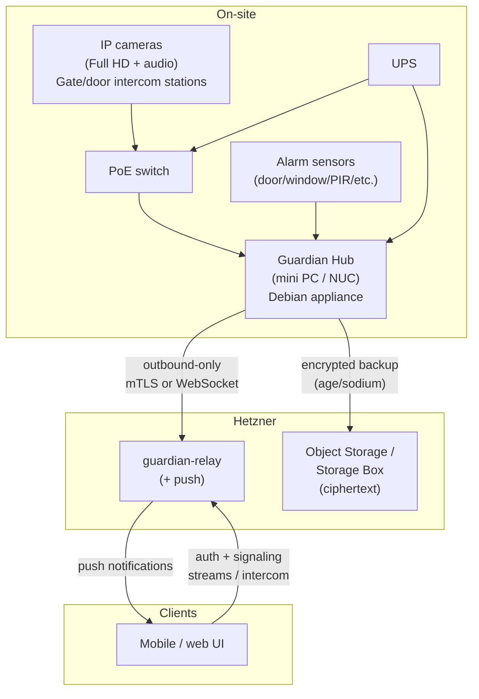
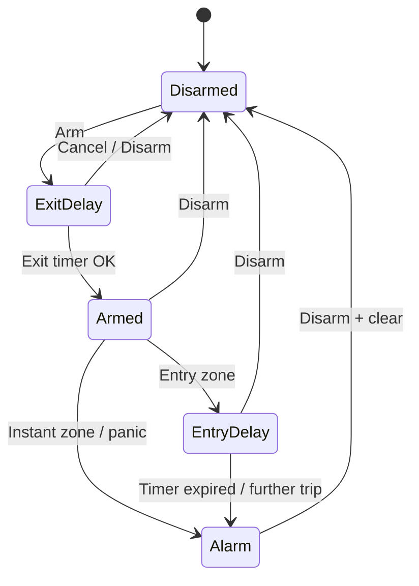

# Guardian — Engineering Design Document

**Product:** DIY combined DVR + alarm appliance  
**Owner:** Cassidy Mugadza  
**Hub platform:** Mini PC / NUC (not Raspberry Pi)  
**Scale target:** 8–16 cameras, many sensor zones (BOM sized at 12-cam midpoint)  
**Status:** Design locked for MVP planning  

---

## 1. Goals & non-goals

### Goals

- **Unified on-site appliance** that records Full HD video+audio from 8–16 IP cameras and runs a full-time online alarm (arm/disarm, zones, sensors, siren/notify).
- **Own the stack:** custom Debian-minimal appliance image + our `.deb` packages + systemd. All application services are ours (default language: **Go**). Linux base and libraries (e.g. ffmpeg) are fine.
- **Remote access** through **our authenticated cloud/relay gateway** (not WireGuard-only): live grid, tap-to-HD, event review, alarm control, and two-way intercom for gate/door stations.
- **Offsite backup** to Hetzner Object Storage (preferred) or Storage Box: client-side encrypted (age/sodium), user-selectable scope at setup, retention + upload bandwidth cap + recovery key.
- **Reliability:** hub is outbound-only to the relay (mTLS or WebSocket); local recording and alarm continue if internet drops.

### Non-goals

- Raspberry Pi as the hub (insufficient for 8–16 Full HD + audio + detect + alarm at this scale).
- Third-party NVR/alarm products as runtime dependencies (no Frigate, no Home Assistant, no commercial NVR/alarm appliances).
- Yocto / custom embedded distro — we stay on **Debian minimal**.
- Replacing ISP router or becoming a general smart-home hub.
- Storing plaintext media in the cloud — ciphertext only on Hetzner.

---

## 2. System context diagram

---

## 3. On-site appliance

### Hardware role

- Mini PC / NUC class x86_64 (or equivalent) with enough CPU/RAM/NVMe for **12 cameras** Full HD continuous record + audio, detect, alarm, and concurrent remote viewers.
- Local storage: large NVMe (or NVMe + HDD) for continuous recording; separate mount for durable event/alarm clips preferred.
- Network: wired uplink to PoE switch; cameras on a dedicated VLAN/subnet where practical.

### OS image

- **Debian minimal** base image (our appliance build).
- Our `.deb` packages install services, units, defaults, and CLI helpers.
- **systemd** owns process lifecycle, restart policy, and ordering.
- Not Yocto; not a container-orchestrated “smart home” stack as the product runtime.

### Packages (illustrative)

| Package | Contents |
|---------|----------|
| `guardian-common` | Shared config schema, certs layout, event-bus library, logging defaults |
| `guardian-recorder` | Continuous + event recording |
| `guardian-detect` | Motion / object heuristics on streams |
| `guardian-alarm` | State machine, arming modes, siren/notify hooks |
| `guardian-sensors` | Zone I/O (GPIO/USB/serial/IP modules) |
| `guardian-api` | Local REST/gRPC for UI and services |
| `guardian-ui` | Local web UI (and packaged assets) |
| `guardian-intercom` | Two-way audio for gate/door |
| `guardian-gateway` | Outbound relay client (mTLS/WebSocket) |
| `guardian-backup` | Encrypt + upload offsite |
| `guardian-setup` | First-boot / wizard + recovery-key flow |

ffmpeg (and similar system libraries) via Debian packages as needed — **not** a third-party NVR product.

### systemd

- One unit per service (`guardian-*.service`), `Restart=on-failure`, ordered dependencies (e.g. bus/api before UI/gateway).
- `guardian.target` aggregates the appliance; setup may enable a subset until wizard completes.

### Config & paths

| Path | Purpose |
|------|---------|
| `/etc/guardian/` | Site config (cameras, zones, arming, backup policy, relay identity) |
| `/etc/guardian/certs/` | Hub client certs / trust anchors for relay mTLS |
| `/var/lib/guardian/` | Durable state (DB, keys metadata, setup flags) |
| `/var/lib/guardian/events/` | Event & alarm clip index |
| `/srv/guardian/recordings/` | Continuous / rolling media (large mount) |
| `/srv/guardian/backup-staging/` | Encrypt staging before upload |
| `/var/log/guardian/` | Service logs (journald primary; optional files) |

### Storage mounts (recommended)

- `/` — OS + packages (SSD).
- `/srv/guardian/recordings` — high-capacity media volume.
- Optional: `/var/lib/guardian` on durable SSD if OS disk is small.

### Internal event bus

- **Our** in-process / localhost bus (Go library + optional local Unix socket or localhost TCP), not Mosquitto-as-a-product-dependency.
- Topics for: sensor transitions, alarm state changes, detect events, recording segment closed, intercom session, backup progress, gateway connectivity.
- Services publish/subscribe; `guardian-api` and `guardian-gateway` fan out to UI and cloud as needed.
- Persistence of critical alarm transitions is owned by `guardian-alarm` (and optionally a small embedded store), not by requiring an external broker product.

---

## 4. Alarm state machine & zones

### Modes

| Mode | Behavior |
|------|----------|
| **Disarmed** | Sensors logged; no siren; optional chime / notify for selected zones |
| **Armed Away** | All configured perimeter + interior zones active after exit delay |
| **Armed Stay / Home** | Perimeter active; selected interior zones bypassed |
| **Alarm** | Triggered state: siren (if configured), push, clip pull, event record |
| **Entry delay** | Entry zone opens while armed → grace period before Alarm |
| **Exit delay** | Leaving after arm → grace before zones fully active |

### Zones

- Each zone: id, name, type (perimeter / interior / 24h / fire / panic / etc.), sensor binding(s), bypass flag, chime, delay profile.
- **24h / panic / fire** style zones can trigger regardless of arm mode (configurable).
- Many zones supported; BOM assumes a multi-zone expander-friendly sensor path.

### State machine (summary)

`guardian-alarm` is source of truth; `guardian-sensors` feeds raw transitions; `guardian-detect` can optionally create soft events (not necessarily hard alarm unless linked).

---

## 5. Video + audio recording & live view

### Requirements

- All camera feeds: **Full HD with audio**.
- Local continuous recording on hub storage; event/alarm clips retained with higher priority under disk pressure.
- Live view locally via `guardian-ui` / `guardian-api`; remotely via relay (see §7).

### Recorder (`guardian-recorder`)

- Ingest RTSP (or vendor URL) per camera; remux/transcode with ffmpeg libraries/CLI as needed.
- Segment continuous recordings; index in local DB.
- On alarm/detect: mark/export clips for UI and backup policy.
- Disk retention: circular buffer by camera + global free-space policy; never delete in-progress alarm evidence before safer retention rules.

### Detect (`guardian-detect`)

- Lightweight motion / optional object heuristics on selected streams or substreams.
- Publishes events on the bus; does **not** replace the alarm panel.
- Tunable per camera to limit CPU at 12-cam scale.

### Live view policy (remote — see also §7)

- **Grid:** substreams.
- **Tap-to-HD:** 1–2 cameras at Full HD.
- **Hard-cap HD** when measured uplink ≲ 50 Mbps.
- Audio follows selected stream; intercom is separate full-duplex path (§6).

---

## 6. Two-way intercom (gate / door)

### Scope

- Gate and door stations with **two-way audio** (and typically a camera).
- Full-duplex audio for talk-down / visitor conversation.

### Architecture

- `guardian-intercom` manages sessions: ring → answer → talk → hangup; ties to camera if co-located.
- Media: **WebRTC** between client and hub **via `guardian-relay`** (signaling + optional TURN-like relay of media when P2P is unavailable).
- Hub remains **outbound-only** to relay; clients connect to relay; relay stitches signaling (and media relay as required).
- Local answer also possible from on-LAN UI without cloud when site network allows.

### Cameras / stations

- Prefer ONVIF/RTSP cameras or dedicated door stations that expose mic/speaker controllable for two-way audio; BOM lists gate/door two-way audio stations separately from bulk cameras.

---

## 7. Remote monitoring

### Relay auth & connectivity

- Hub runs `guardian-gateway`: persistent **outbound** connection to `guardian-relay` using **mTLS or WebSocket** (mutually authenticated session).
- No inbound ports required on the home firewall for Guardian.
- Clients authenticate to relay (account / device tokens); authorization scoped to the user’s site.

### Signaling & streams

- Relay brokers live-view signaling: which camera, substream vs HD, session limits.
- Enforce remote stream policy: substreams for grid; tap-to-HD 1–2 cams; HD hard-cap if uplink ≲ 50 Mbps.
- Intercom: WebRTC signaling through relay; media via relay when needed.

### Push

- `guardian-relay` (+ push): alarm, ring, offline-hub, backup-failure style notifications to mobile clients.
- Hub emits notify intents over the gateway channel; relay fans out to APNs/FCM (or equivalent) without exposing hub.

### Not WireGuard-only

- Optional VPN is not the product remote-access path. Product path is **authenticated cloud/relay gateway**.

---

## 8. Hetzner deploy

### Components

| Component | Role |
|-----------|------|
| **guardian-relay VM** | Auth, hub sessions, client sessions, signaling, push fan-out, stream policy enforcement |
| **Object Storage** (preferred) or **Storage Box** | Offsite ciphertext for backups |

### Firewall / network (VM)

- Public: HTTPS (clients + hub WebSocket/mTLS endpoint), push-related egress.
- Restrict admin SSH (key-only, allowlisted).
- Hub identity: pin client certs or enrollment tokens; revoke compromised hubs.
- Object Storage credentials only on hub for upload (scoped keys); relay need not read backup objects for MVP.

### Ops notes

- Size VM for concurrent hubs × viewers (start modest; scale vertically/horizontally later).
- TLS certificates for public endpoint; hub mTLS CA operated by us.
- Monitoring: relay uptime, hub connection count, error rates — out of band from customer media.

---

## 9. Offsite backup & setup wizard options

### Client-side encryption

- Encrypt on hub **before** upload (age and/or libsodium constructions).
- Hetzner stores **ciphertext only**.
- **Recovery key** generated/shown at setup; user must store offline — without it, cloud data is unrecoverable by design.

### User-selectable scope (setup)

| Option | Scope |
|--------|-------|
| **(1)** | Events & alarm clips only |
| **(2)** | Events + rolling continuous window |
| **(3)** | Full continuous mirror |

Also configured at setup (and editable later with care):

- **Retention** (days / GB cap).
- **Upload bandwidth cap** (protect household uplink).
- Recovery key acknowledgment.

### `guardian-backup`

- Selects objects per policy; encrypts to staging; uploads to Object Storage/Storage Box; resumes; respects bandwidth cap.
- Verifies remote object presence; local index of backup sets.
- Restore path: decrypt locally with recovery key (documented procedure; MVP may be CLI-first).

### `guardian-setup`

- First boot wizard: network, cameras, zones, arming defaults, relay enrollment, backup option (1/2/3), retention, bandwidth, recovery key display.
- Writes `/etc/guardian/` and enables systemd units.

---

## 10. Security / threat notes (brief)

- **Outbound-only hub** reduces attack surface from the internet.
- **mTLS / authenticated WebSocket** between hub and relay; clients separately authenticated and authorized.
- **Client-side encryption** for offsite media; cloud compromise ≠ plaintext footage.
- Local UI/API bound to LAN (+ optional auth); do not expose hub API ports on WAN.
- Protect `/etc/guardian/certs` and recovery key material; disk encryption of hub recommended for theft scenarios.
- Threats to acknowledge: stolen recovery key, compromised client token, malicious camera on LAN, physical sensor tampering — mitigate with enrollment, revoke, tamper zones, and least privilege on cloud keys.
- Supply chain: pin Debian packages; sign our `.deb`s; verified appliance updates.

---

## 11. MVP milestones (phased)

### Phase 0 — Foundations

- Debian appliance image skeleton, packaging, `guardian-common`, local event bus, config layout.
- `guardian-api` + minimal `guardian-ui` (LAN).

### Phase 1 — Record & live (LAN)

- `guardian-recorder` for N cameras Full HD+audio; retention.
- Local live view; basic detect events.

### Phase 2 — Alarm

- `guardian-sensors` + `guardian-alarm` state machine, zones, arm/disarm, entry/exit delays, local siren hook + notifications stub.

### Phase 3 — Relay remote

- Hetzner `guardian-relay`; `guardian-gateway` outbound; remote grid/substream + tap-to-HD policy; push for alarms.

### Phase 4 — Intercom

- `guardian-intercom` + WebRTC via relay for gate/door; full-duplex audio.

### Phase 5 — Offsite backup

- `guardian-backup` + setup options (1/2/3), encryption, retention, bandwidth cap, recovery key.
- Object Storage integration.

### Phase 6 — Hardening & scale

- 12-cam soak tests, uplink HD cap behavior, update channel, backup restore dry-run, threat mitigations from §10.

---

## 12. Open questions (genuine unknowns)

1. **Exact hub SKU** within mini PC/NUC class (CPU generation, NIC, NVMe capacity) pending current pricing and 12-cam soak benchmarks.
2. **Sensor hardware bus** final choice (wired GPIO expander vs ESP/IP modules vs alarm-panel-style zone boards) — interface abstracted in `guardian-sensors`, physical pick still open.
3. **Intercom station models** that cleanly support Full HD + reliable two-way audio under our control (vs proprietary cloud-only stations).
4. **Push providers** and app store accounts for production APNs/FCM (ops/account setup, not architecture).
5. **Object Storage vs Storage Box** final default per region/pricing at deploy time (architecture supports both; Object Storage preferred).
6. **Detect model depth** for MVP (motion-only vs light object classes) given CPU budget at 12 cams — product intent is ours, model weight TBD after profiling.
7. **Legal/retention defaults** by jurisdiction for continuous recording and cloud mirror (policy copy, not core protocol).

---

*End of design document. Locked decisions in the project brief take precedence over any conflicting older notes.*

---

## Addendum — UI language & dependencies (2026-09-11)

**Locked:** The system UI is implemented in **Zig**, with a minimal-dependency policy:

- No Electron, React, Flutter, or similar UI frameworks.
- Prefer Zig standard library + Linux OS APIs (DRM/KMS or Wayland, sockets to `guardian-api`).
- No third-party NVR/alarm products; own the UX and IPC.
- Media decode / WebRTC: treat any external library or helper process (e.g. ffmpeg subprocess) as an **explicit exception** documented in this design — not a silent dependency sprawl.
- `guardian-ui` package is a Zig application; web static UI is deferred or removed in favor of the Zig panel for the appliance.

Remote clients may later reuse the same Zig codebase or a thin Zig remote viewing client talking through `guardian-relay`.

## Security controls

Priority controls for reducing vulnerability and blast radius on the Guardian appliance + Hetzner relay. These are design requirements, not optional polish.

### Attack-surface reduction

- **Outbound-only hub:** no inbound ports from the internet; the hub initiates connections to `guardian-relay` only.
- **Minimal Debian image:** no desktop environment, no unused packages, no compilers/toolchains on production images.
- **Zig UI + minimal dependencies:** no Electron/React/Flutter; prefer Zig stdlib + Linux OS APIs. Any media/WebRTC helper is an explicit, documented exception (pinned/vendored), not silent dependency sprawl.
- **Camera network isolation:** cameras on a dedicated VLAN/subnet reachable by the hub; phones and laptops must not sit on that segment.
- **Cameras:** disable vendor cloud/UPnP; local RTSP only; unique strong credentials; firmware updates owned as an ops chore.
- **Do not** expose the Zig UI or `guardian-api` on the public internet. Remote access is only via the authenticated relay.

### Authentication & keys

- **mTLS** between hub (`guardian-gateway`) and relay, with per-site device certificates.
- App sessions use **short-lived tokens**; revoke compromised devices without rotating the whole site when possible.
- **Arm/disarm:** PIN with rate limiting and lockout; consider a second factor for remote arm/disarm.
- **Key separation:** site identity ≠ backup encryption key ≠ relay admin credentials. Compromise of the Hetzner VPS must not yield plaintext offsite video.
- Backup uses **client-side encryption** (age/sodium); recovery key printed at setup and never stored in plaintext in the cloud.

### Process isolation (systemd)

Each Guardian daemon runs as its own service user with a tight unit, including at minimum:

- `ProtectSystem=strict`
- `PrivateTmp=yes`
- `NoNewPrivileges=yes`
- Narrow `CapabilityBoundingSet` / `RestrictAddressFamilies`
- Only the sockets, device nodes, and directories that service requires

Hostile-input assumption for RTSP, Zigbee/sensor frames, and WebRTC signaling: length limits, timeouts, no shelling out with untrusted URLs.

### Supply chain

- Vendor or pin every allowed dependency; prefer reproducible builds for `.deb` packages and the Zig UI.
- Signed private apt (or image) updates; no `curl | bash` on the appliance.
- Maintain an SBOM for the appliance image; scan for CVEs on a cadence.
- Updates must be **signed** and support **rollback** so a bad update cannot brick alarming.

### Operations & runtime

- UPS for hub + PoE switch; **disk encryption** for the media volume (NUC theft scenario).
- Append-only local **audit log** for arm/disarm, relay sessions, and backup restores; optional encrypted summaries offsite.
- Relay heartbeat / “site dark” alerting when the hub stops checking in.
- Hetzner: firewall allows **443 only** to the relay; storage credentials scoped to a single bucket; SSH via keys only (no password auth); optional admin VPN.

### Explicit non-goals (early)

- Public Zig UI or API endpoints “for convenience.”
- Continuous plaintext video stored in the cloud.
- Shared passwords across cameras, hub, and developer accounts.

---

## Addendum — Recording resolution (2026-09-11)

**Locked:** `guardian-recorder` must support ingest and retention of **4K (2160p)** and **8K (4320p)** streams, in addition to Full HD.

Design implications:
- Prefer cameras that offer RTSP main + substream; record main at configured max resolution; use substream for remote grids / detect when needed.
- At 8–16 cameras, continuous **8K on every camera** is usually impractical (disk, PoE/switch, CPU/GPU, uplink). Architecture must allow **per-camera max resolution** and profiles (e.g. gate/door 4K, overview 1080p, optional 8K on select cams).
- Hub sizing: hardware video encode/decode (Quick Sync / NVENC / VCN) strongly preferred for multi-4K; 8K limited to few concurrent streams unless the NUC-class box is upgraded.
- Storage/bitrate planning and retention UI must surface estimated disk use when 4K/8K is enabled.
- BOM and live-view defaults still use substreams remotely; tap-to-HD becomes tap-to-configured-max (4K/8K when selected and uplink allows).

## Addendum — Wired-only hardware (2026-09-13)

**Hard rule:** All hardware that talks to the hub is **wired**. No device may connect to the hub wirelessly.

### Forbidden at the hub edge
- Wi-Fi cameras
- Zigbee / Z-Wave / Thread / Bluetooth sensors or coordinators used as the site bus
- Wireless door/window/PIR kits as primary zones
- Wireless sirens as the primary alarm output (unless also hard-wired)

### Required patterns
- **Cameras / door / gate stations:** PoE Ethernet (or Ethernet + separate power), local RTSP; no vendor cloud dependency for core function
- **Sensors:** hard-wired contacts and PIRs into a **wired zone expander** (Ethernet/USB/GPIO/RS-485) that the hub reaches over cable
- **Siren / relays / gate strike:** wired 12 V / dry contact from a hub-controlled I/O module
- **Admin phones:** may use Wi-Fi/cellular to reach the **relay in the cloud**; that is not a hub-edge wireless device

### Software impact
- Prefer `guardian-sensors` drivers for wired expanders over Zigbee2MQTT-style stacks
- Camera VLAN remains Ethernet-only

## Addendum — OEM vs custom hardware strategy (2026-09-13)

**Goal:** Reduce known and unknown vulnerabilities by owning the alarm/DVR stack (Zig) and keeping the hub edge **wired-only**.

**Zig rationale:** Systems language with fewer dependencies and a smaller “commodity IoT” ecosystem than typical C/C++/vendor SDKs for this product class. Treated as defense-in-depth (memory discipline + less copy-paste firmware), not as security-through-obscurity alone.

**Phase strategy:**
1. **OEM wired parts** for lab/MVP: PoE RTSP cameras, managed PoE switch, Ethernet/USB dry-contact DI/DO expanders, hard-wired contacts/PIR/siren.
2. **Custom zone expander** (next hardware design): our protocol + supervised zones + siren/relay — replace open industrial Modbus where trust matters.
3. **Custom door station / camera** only if OEM video firmware trust is unacceptable (higher cost/time).

Phones may use wireless networks only to reach the cloud relay, never as hub-edge sensors/cameras.
